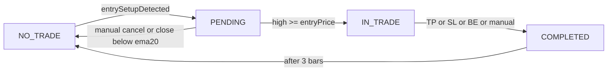

# entry_mgmt.pine — Architecture map

Single-trade overlay indicator: detects a long entry setup (EMA breakout + pause), draws entry/SL/BE/TP, and manages one trade through completion. Use this doc to find where to add or change logic.

## Sections and line ranges

| Section | Lines | What lives here |
|---------|-------|-----------------|
| Inputs | 4–33 | Entry Detection, Context & Validation, Risk Management, Manual Controls, Alerts |
| Calculations | 34–116 | EMAs, ATR, breakout tracking, pause pattern, distance filter, context (HTF trend), validation (validation TF) |
| Entry setup detection | 117–120 | Single combined condition `entrySetupDetected` (includes `htfTrendBullish` and `validationSignal`) |
| State machine vars | 121–155 | Trade state, levels, line/label refs, timestamps |
| State machine logic | 159–565 | NO_TRADE, PENDING, IN_TRADE, COMPLETED branches |
| Visual elements | 566–579 | Trend highlight bgcolor, setup bgcolor, validation plotchar, C:/V: watermark table |
| Status table | 580–701 | Table creation, showTable, and all table.cell + RR logic |
| Alert conditions | 702+ | `alertcondition` calls |

Note: line numbers are from the current script; re-check after edits.

## Context & validation

Entries are only allowed when **both** context and validation are bullish. Context uses a higher timeframe (e.g. W): EMA20 > EMA100 and close > EMA20. Validation uses a separate timeframe (e.g. D): unlocked state (full candle above 20 EMA unlocks), EMA20 sloping up, and price above EMA20. The combined `entrySetupDetected` ANDs the chart-timeframe setup with `htfTrendBullish` and `validationSignal`. The C:/V: watermark in the top-right shows the context and validation timeframes; text is green when that signal is bullish, black when not (for future bearish support).

## State machine

- **NO_TRADE:** Looking for `entrySetupDetected`. On trigger: compute levels, create lines/labels, set `tradeState := STATE_PENDING`, reset breakout-tracking vars.
- **PENDING:** Extend lines/labels each bar. Cancel: manual toggle or `close < ema20` → delete all lines/labels, reset vars, `tradeState := STATE_NO_TRADE`. Entry: `high >= entryPrice` → `tradeState := STATE_IN_TRADE`, set `entryTime`.
- **IN_TRADE:** Extend lines/labels; check BE trigger (1R); check TP/SL/BE/manual exit → `tradeState := STATE_COMPLETED`, set `exitReason` and `completedBarIndex`.
- **COMPLETED:** For 3 bars keep lines visible and extend them; then delete all lines/labels, reset all trade vars, `tradeState := STATE_NO_TRADE`.

## Key persistent vars

All are `var` (or used inside `if` that assigns to `var`). Reset as noted.

| Var | Purpose | Reset on |
|-----|---------|----------|
| `breakoutBarIndex`, `highestHighInPause`, `highestHighBarIndex`, `highestHighTime` | Breakout + pause tracking | When setup fires (NO_TRADE→PENDING) or price goes below 20 EMA |
| `valIsLocked` | Validation TF lock state (full candle below 20 EMA locks) | Set by validation TF full-candle conditions |
| `tradeState` | Current state | Set on every transition |
| `entryPrice`, `stopLossPrice`, `breakEvenPrice`, `takeProfitPrice`, `entryBarIndex` | Trade levels | Cancel, or COMPLETED cleanup (after 3 bars) |
| `breakEvenTriggered`, `wasInProfitAfterBE` | BE logic | Cancel; COMPLETED cleanup |
| `exitReason`, `entryTime`, `setupTime`, `completedBarIndex` | Exit + timestamps | COMPLETED cleanup |
| `entryLine`, `slLine`, `beLine`, `tpLine`, `entryLabel`, `slLabel`, `beLabel`, `tpLabel` | Drawing refs | Deleted and set to `na` on cancel or COMPLETED cleanup (BE line/label reuse entry when BE triggers) |

## Break-even rules

- **BE trigger:** When price reaches `entryPrice + (entryPrice - stopLossPrice) * rrBreakEven` (default 1R). Then: `breakEvenTriggered := true`, entry line/label become BE line/label (orange), SL line style → dotted (level unchanged).
- **Exit at BE:** Trade completes at BE only when: `breakEvenTriggered` and `wasInProfitAfterBE` (price traded above entry on a bar after BE) and `low <= breakEvenPrice` and not on the same bar BE was triggered. Do not add BE exit logic that ignores `wasInProfitAfterBE`.

## Line/label lifecycle

- **Create:** In NO_TRADE when `entrySetupDetected` (lines 151–201). Entry, SL, TP get new line + label; BE is created later by converting entry line/label when BE triggers.
- **Update (extend):** Every bar in PENDING (212–241) and IN_TRADE (330–363), and in COMPLETED while `barsSinceCompletion <= 3` (416–434). Labels moved to `bar_index`.
- **Delete:** On manual cancel (244–276), auto-cancel (284–318), and in COMPLETED after 3 bars (495–531). Every cleanup must delete all four line/label refs and set them to `na` (and reset level vars).

When adding a new drawn level (e.g. TP2): add a `var` line/label, set it in the same block where entry/SL/TP are created, and add create/update/delete in every block that currently handles the four levels.

## Working on features

- **One feature per change** (e.g. one new exit type or one new filter).
- **New entry condition:** Extend Calculations and/or Entry setup detection; keep `entrySetupDetected` as the single combined boolean (currently includes `htfTrendBullish` and `validationSignal`).
- **New level (e.g. TP2):** Add `var` for price and line/label; set them when transitioning to PENDING (same block as entry/SL/TP); in PENDING, IN_TRADE, and COMPLETED, add the new level to every block that updates or deletes lines/labels.
- **New state or exit type:** Add a branch in the state machine; set `tradeState` and `exitReason`/`completedBarIndex` in one place; ensure cleanup (cancel and COMPLETED) still deletes all lines/labels and resets the same var set.

## Definition of done

Before considering a change to `entry_mgmt.pine` complete:

1. **Test:** Run in TradingView (setup → pending → fill → BE/TP/SL/cancel) and confirm behaviour.
2. **Update this doc** if you:
   - Added, removed, or renamed a **section** → update the "Sections and line ranges" table and any line numbers in the doc.
   - Added, removed, or changed a **state or transition** → update the "State machine" diagram and bullet list.
   - Added, removed, or changed **key persistent vars** or what gets reset → update the "Key persistent vars" table.
   - Added a **new line/label type** (e.g. TP2) → update "Line/label lifecycle" and any "four levels" wording.
3. **Update [.cursor/rules/entry-mgmt.mdc](.cursor/rules/entry-mgmt.mdc)** if you introduced a new convention or invariant that should apply to future edits (e.g. new state, new "always do X" pattern).

**Live trading (Python / automation):** [live-trading-architecture.md](live-trading-architecture.md) — same YAML shape as backtest, `liveTradingEnabled`, per-ticker configs, rollout stages.
