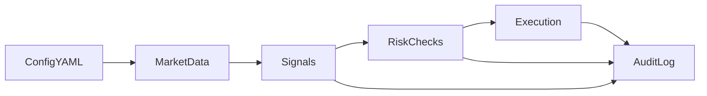

# Live trading — Architecture and rollout

Road map for turning the entry management stack from backtest and scan into **controlled live trading**. Strategy logic and parameters stay aligned with TradingView [`entry_mgmt.pine`](entry_mgmt-architecture.md) (architecture map in [entry_mgmt-architecture.md](entry_mgmt-architecture.md)); Python automation today loads OHLC from Oanda-style APIs for scans. A **dedicated live execution path** (orders, positions, broker reconciliation) is assumed to be built or plugged in later—this doc defines **config rules**, **rollout stages**, and **future integration points**.

**Non-goals:** This document is not investment or tax advice, and it does not promise any uptime or execution guarantee for a production deployment.

## Config contract (canonical)

Live configs use the **same YAML shape** as backtest/scan. The authoritative field list is [entry-mgmt-automation/config.yaml](entry-mgmt-automation/config.yaml): top-level keys such as `scan`, `run`, `timeframes`, `entry_detection`, `risk_management`, `mtf_fetch`, `symbols`, and any optional blocks documented there.

**One extra top-level key** is allowed and required for live intent:

| Key | Type | Meaning |
|-----|------|--------|
| `liveTradingEnabled` | boolean | If `true`, this file is **authorized for** a live trading process (once that process exists). If `false` or **omitted**, treat as **backtest / scanner only**; no live process may place or cancel orders based on this file alone. |

**Rules:**

- **Schema parity:** Do not fork field names between “backtest” and “live” configs. The same `load_config` contract in [`mtf_loader.py`](entry-mgmt-automation/mtf_loader.py) applies; live-only operational knobs can later live in additional keys that are **ignored** by scan/backtest (document them here when added).
- **Per ticker:** Prefer **one YAML file per symbol** (e.g. `config/live/EUR_USD.yaml`) with exactly **one** entry under `symbols:` and the **full** structure duplicated per file. That avoids mixing “live on A, backtest on B” in a single ambiguous file.
- A shared “defaults + overlay” pattern for YAML is **future-only**; not required for the first rollout.

**Implementation note (today):** Scan and backtest code paths do not yet branch on `liveTradingEnabled`. When a live runner exists, it must **refuse** to arm execution unless `liveTradingEnabled` is explicitly `true`, and must **never** infer live mode from omission.

## Component map

| Component | Role | Status |
|-----------|------|--------|
| Config (YAML) | Strategy params + run metadata; `liveTradingEnabled` gate | **Current** (scan/backtest); gate honored when live runner exists |
| Data feed | Live candles / quotes for entry, validation, context TFs | **Current** (Oanda-style fetch for research); live cadence TBD |
| Strategy / signals | Parity with Pine state machine and levels | **Current** in automation scanner pipeline; live must match tested behavior |
| Risk gates | Size limits, max loss, max positions, session filters | **Planned** for live path |
| Execution adapter | Broker API: orders, cancels, amendments | **Planned** |
| Position / order state | Reconciled truth vs broker | **Planned** |
| Event log | Structured audit trail for decisions and fills | **Planned** (dashboards consume this) |
| Overrides / kill switch | Global or per-symbol pause, manual flat, no new entries | **Planned** |

## High-level flow (target)



Every stage should be able to justify “what happened” from **ConfigFile** + **AuditLog** (even if AuditLog is a file or DB table later).

## Rollout stages

Each stage has a **goal**, **what is enabled**, and **exit criteria** before moving on.

| Stage | Goal | Enabled | Exit criteria |
|-------|------|---------|---------------|
| **0 — Shadow / parity** | Prove live data + logic match backtest; **no orders** | Logging of “would enter”, “would exit”, levels vs reference | Agreement checks on sample periods; known discrepancies documented or fixed |
| **1 — Minimal live** | Real orders for **one** symbol, smallest allowable risk | Single config file with `liveTradingEnabled: true`; hard caps; kill switch tested once | Stable behavior over agreed calendar window; runbook for incidents |
| **2 — Multi-symbol** | Same safety model, **one file per symbol** | Multiple configs each with their own params and flag; explicit operator allowlist | Each symbol completed shadow or paper gate before full risk |
| **3+ — Observability and control** | Operator-grade visibility and intervention | Structured **events** for dashboards; **notifications** on alerts; **manual overrides** (pause, flat, block new entries) | Events sufficient to reconstruct sessions without guessing; overrides audited |

Stages 3+ are **integration points** only in this document; implementation details belong in code and runbooks as they land.

### Stage 0 — substeps

Stage 0 is "shadow only": run the same logic you used for backtesting and scanning, but do **not** place or cancel real orders.

0.1 Baseline
- Pick one symbol and reuse the backtest-passing YAML by placing it into `config/live/<SYMBOL>.yaml`.
- For Stage 0 shadow usage, keep `liveTradingEnabled` set to `false` or omit it.

0.2 Shadow runner (cadence + buffered indicators + candidate-only logs)
- Driver cadence: use `timeframes.entry` (your lowest TF in this config shape). Example: if `timeframes.entry` is `M5`, run roughly every `5m + ~1s` so you evaluate the latest **closed** candle.
- For each run/tick, set `scan.windows/to` so you evaluate only the last fully closed entry-interval candle (exclude the currently forming candle). Set `scan.from` far enough back that indicator warm-up works (your existing loader buffering handles this).
- Runner pipeline (no execution): run `entry-mgmt-automation/mtf_loader.py` -> `entry-mgmt-automation/scanner_indicators.py` -> `entry-mgmt-automation/scanner_entry_mgmt.py`, but treat output as **candidate-only logging** for Stage 0.2 (logging potential entries even if later cancelled is OK).
- Logging: write a per-ticker log file (docker-friendly) containing at least `setup_time`, `entry_price`, `sl`, `tp`, and `symbol` from the candidate record. Optionally also log context/validation booleans for debugging parity.
- Database decision (0.2): Stage 0.2 does not *require* DB-backed state for correctness; you can keep the “source of truth” as log files (and compare them to backtest output). DB persistence is optional until you need it for dashboards/replay.

0.3 onwards
- Database decision (0.3+): once you want live trades to appear like backtested runs (dashboard parity) and/or you need “triggered vs cancelled over time”, you should persist live state in SQLite:
  - reuse the existing `scan_runs` + `raw_trades` approach for completed trades (so the frontend can stay unchanged), and/or
  - introduce additional tables for non-completed setups/candidates if you want richer lifecycle tracking.
- Operationally, keep live separate from backtest either by using a separate `database.path` per environment or by using a dedicated “live” DB file (so you don’t mix datasets while iterating).

## Safety and operations

- **Kill switch:** One obvious way to stop new risk (process flag, env, or external control) that does not require editing strategy code under stress.
- **Caps:** Max position size, max open trades, and max daily / rolling loss appropriate to stage; tighten before widening.
- **Disconnect / stale data:** Define behavior when feeds lag or fail (typically: do not open; consider flatten policy only if already coded and tested).
- **Reconciliation:** Do not assume internal state matches the broker; if position is unknown or mismatched, **do not** send discretionary size-increasing orders until reconciled.
- **Config mismatch:** If effective YAML on disk differs from what the running process loaded, prefer **reload or restart** with explicit logging—never silent drift.

## Example: top of a live-eligible config

```yaml
# Same sections as entry-mgmt-automation/config.yaml; flag authorizes live when a live runner exists.
liveTradingEnabled: true

scan:
  windows:
    - from: "2020-01-01T00:00:00Z"
      to:   "2026-01-01T00:00:00Z"
run:
  key: "eur_usd_live_shadow_or_production"
  overwrite: true
timeframes:
  entry: "M5"
  validation: "H1"
  context: "D"
# ... entry_detection, risk_management, mtf_fetch ...
symbols:
  - "EUR_USD"
```

For **Stage 0**, keep `liveTradingEnabled: false` (or omit) on configs used only with the scanner; use `true` only when a live runner is actually enforcing the gate and you intend orders (Stage 1+).

## Definition of done (process)

Before calling a live milestone “complete”:

1. **Config:** File matches [entry-mgmt-automation/config.yaml](entry-mgmt-automation/config.yaml) shape; `liveTradingEnabled` set **intentionally**; one symbol per file if multi-symbol.
2. **Evidence:** Shadow or paper logs show expected decisions for the scenarios you care about.
3. **Ops:** Kill path and reconciliation policy are written down (even as bullets in a private runbook).
4. **Update this doc** when you add a **new top-level key**, change **stage exit criteria**, or introduce a **live-only risk rule**—see below.

## Maintaining this document

When you change the system in ways operators depend on:

- **New config field (especially live-only):** Add it to **Config contract** (table or bullets) and mention whether scan/backtest ignores it.
- **New rollout stage or gate:** Update **Rollout stages** and **Definition of done**.
- **New safety rule:** Update **Safety and operations**.
- **Pine / state machine behavior:** Keep [entry_mgmt-architecture.md](entry_mgmt-architecture.md) as the source of truth for the indicator; link from here when narrative overlap matters.
